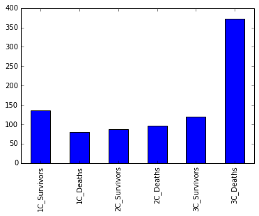
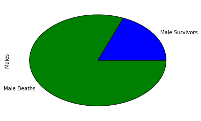
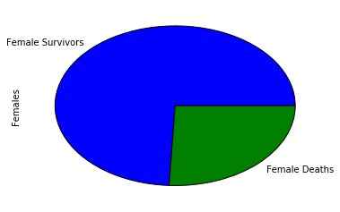
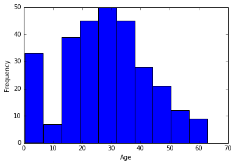
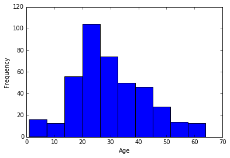
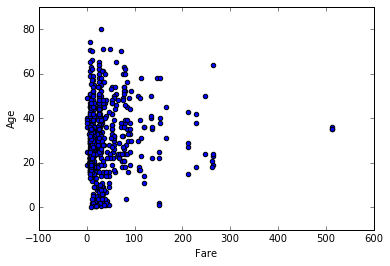

# Questions

The purpose of this data investigation is to determine what factors (if any) made it more like that a person survived. Specifically, three variables were analyzed: class, sex, and age. The hypothesis is that higher class passengers that are female and younger had a higher chance of surviving. 

Another question posed for this project is whether the average fare by age differed when embarking from Southampton (labelled S in the data). It is hypothesized that there is no significant difference in the average fare based on age.


# Loading Data


```python
import pandas as pd
import numpy as np
import matplotlib.pyplot as plt
import scipy.stats as sp

df = pd.read_csv('./titanic_data.csv')

# Remove cabin, ticket, and name column as they will not be used.
# This should make further calculations with the DataFrame marginally faster
del df['Cabin']
del df['Ticket']
del df['Name']
```

# Fixing Data Types

When fixing data types, I first decided to remove the ticket, cabin, and name columns from the data. After going through it, I realized that the passenger could be recognized by their passenger id, so there name wasn't particiularly relevant. Additionally, the information regarding the ticket wasn't relevant at all for my case. For the cabin column, there was so much data missing that it would serve no useful purpose in my data analysis, so it was removed.

The fare column appeared to be rounded to 4 decimal places (not really sure how, maybe from conversion rates?). I decided it would be a good idea to work with numbers up to two decimal points, as that is what I considered to be the most realistic choice. Although there is uncertainty involved, it was assumption I chose to make. Something I also realized was that the fare column has no currency! I would assume it would be the currency of the respective cities at that given time, but it's still a thought to note. The website where the data was retrieved did not contain any explanation on it either.

For ages, a cutoff of Q3 + 1.5 x Interquartile Range was used. Since the interquartile range for age was (38-20.125), then the maximum/minimum bounds were 38 + 1.5 x (30-20.125) = 64.8125. Pandas has a nice functionality that allows us to remove all rows over this number. Therefore, anyone older than 64 was removed from the data.

The last modification (albeit minor) was that each data type was converted to a smaller format as it saves marginally more space.


```python
'''
Memory usage per column is 7128 bytes (i.e., survivors are binary and int64)
so it's a good idea to convert it to the appropriate data type. While the
number of rows isn't that large, I think it's good practice for extremely
larger data sets.
'''

df[['PassengerId', 'Survived', 'Pclass', 'SibSp', 'Parch']]\
    = df[['PassengerId', 'Survived', 'Pclass', 'SibSp', 'Parch']].astype(int)

# Round Fares to 2 decimal places as opposed to 4
df['Fare'] = np.round(df['Fare'], decimals=2)

# Remove all NaN/null age entries and remove all outliers
age_no_null = df[df['Age'].notnull()]


# Maximum bound = Q3 + 1.5 * IQR
# Minimum bound = Q1 - 1.5 * IQR

maximum_bound = (38 - 20.125) * 1.5 + 38
minimum_bound = 20.125 - (38-20.125) * 1.5
clean_age_df = age_no_null[(age_no_null['Age'] > minimum_bound) & (age_no_null['Age'] < maximum_bound)]

# Old data for convenience prior to changing
age_no_null['Age'].describe()
```


    count    714.000000
    mean      29.699118
    std       14.526497
    min        0.420000
    25%       20.125000
    50%       28.000000
    75%       38.000000
    max       80.000000
    Name: Age, dtype: float64


# Investigating Factors for Survival


```python
# Get all records where a passenger survived
survivors = df[df['Survived'] == 1]
non_survivors = df[df['Survived'] == 0]

# Variables related to survivor factors, separated into class, gender, and age.

num_first_class_survivors = len(survivors[survivors['Pclass'] == 1])
num_second_class_survivors = len(survivors[survivors['Pclass'] == 2])
num_third_class_survivors = len(survivors[survivors['Pclass'] == 3])

num_first_class_deaths = len(non_survivors[non_survivors['Pclass'] == 1])
num_second_class_deaths = len(non_survivors[non_survivors['Pclass'] == 2])
num_third_class_deaths = len(non_survivors[non_survivors['Pclass'] == 3])

num_males = len(df[df['Sex'] == 'male'])
num_females = len(df[df['Sex'] == 'female'])

num_male_survivors = len(survivors[survivors['Sex'] == 'male'])
num_female_survivors = len(survivors[survivors['Sex'] == 'female'])
num_male_non_survivors = len(non_survivors[non_survivors['Sex'] == 'male'])
num_female_non_survivors = len(non_survivors[non_survivors['Sex'] == 'female'])

survivor_ages = clean_age_df[clean_age_df['Survived'] == 1]
non_survivor_ages = clean_age_df[clean_age_df['Survived'] == 0]
```

# Custom Functions


```python
# Takes in the function's data and a string representing what type of plot it is (i.e., bar, pie, etc.)
def plot_series(data, kind_str):
    data.plot(kind=kind_str)

# Prints survivors/deaths by number
def print_survivors_by_class():
    print 'First class survivors: ' + str(num_first_class_survivors)
    print 'First class deaths: ' + str(num_first_class_deaths)
    print 'Second class survivors: ' + str(num_second_class_survivors)
    print 'Second class deaths: ' + str(num_second_class_deaths)
    print 'Third class survivors: ' + str(num_third_class_survivors)
    print 'Third class deaths: ' + str(num_third_class_deaths)
    
# Custom function for plotting histograms/scatterplot

def plot_data(data, xLabel, yLabel, kind_str):
    fig, ax = subplots()
    if kind_str == 'hist':  
        ax.hist(data)
        ax.set_xlabel(xLabel)
        ax.set_ylabel(yLabel)
        show()

    elif kind_str == 'scatter':
        plt.scatter(data[0], data[1])
        ax.set_xlabel(xLabel)
        ax.set_ylabel(yLabel)
        show()
    
    
```

**Note, the fig, ax tuple was used in order to get the plots to print.

# Plotting Survivors/Deaths by Class


```python
%pylab inline
plot_series(pd.Series([num_first_class_survivors, num_first_class_deaths, num_second_class_survivors,\
                                num_second_class_deaths,num_third_class_survivors,\
                               num_third_class_deaths],\
                               index=['1C_Survivors', '1C_Deaths', '2C_Survivors', '2C_Deaths',\
                                      '3C_Survivors', '3C_Deaths']), 'bar')

# Call function to print number of survivors/deaths per class.
print_survivors_by_class()
```

    Populating the interactive namespace from numpy and matplotlib
    First class survivors: 136
    First class deaths: 80
    Second class survivors: 87
    Second class deaths: 97
    Third class survivors: 119
    Third class deaths: 372
    





# Discussion

The results indicate that 41.7% of the passengers on the ship were third class and died. From the first class passengers, 63% survived. 47% of the second class passengers survived. A mere 24% of the third class passengers survived. Based on initial glance, it appears that there is a correlation between survival rate and class.

Delving deeper, we use a chi-squared test with an an alpha coefficient of 0.95 and degrees of freedom of 2. 

Our null hypothesis and alternative hypothesis is shown below:
H<sub>0</sub>: Survival and Pclass are independent.
H<sub>A</sub>: Survival and Pclass are <em>not</em> independent.

Running the chi squared function from scipy below, we see that the p-value is 4.54 * 10<sup>-23</sup>, which far smaller than 0.05. Therefore, we reject the null hypothesis -- survival and pclass are related. In fact, the evidence is quite striking: the social class of the passenger played a very important role in whether or not they survived or not. 


```python
obs = np.array([[80, 97, 372], [136, 87, 119]])
chi2, p, dof, ex = sp.chi2_contingency(obs, correction=False)
print "p-value: ", p
print "Chi-squared score: ", chi2
print "Expected values: ", ex
```

    p-value:  4.5492517113e-23
    Chi-squared score:  102.888988757
    Expected values:  [[ 133.09090909  113.37373737  302.53535354]
     [  82.90909091   70.62626263  188.46464646]]
    

# Plotting Survivors/Deaths by Males


```python
plot_series(pd.Series([num_male_survivors, num_male_non_survivors], index=['Male Survivors', 'Male Deaths'], name='Males'), 'pie')
print 'Male survivors: ' + str(num_male_survivors)
print 'Male deaths: ' + str(num_male_non_survivors)
print 'Number of males: ' + str(num_males)
print 'Proportion of male survivals: ' + \
        str(float(num_male_survivors)/(num_male_survivors + num_male_non_survivors))
```

    Male survivors: 109
    Male deaths: 468
    Number of males: 577
    Proportion of male survivals: 0.188908145581
    





# Plotting Survivors/Deaths by Females


```python
plot_series(pd.Series([num_female_survivors, num_female_non_survivors],\
                    index=['Female Survivors', 'Female Deaths'], name='Females'), 'pie')
print 'Female survivors: ' + str(num_female_survivors)
print 'Female deaths: ' + str(num_female_non_survivors)
print 'Number of females: ' + str(num_females)
print 'Proportion of female survivals: ' + \
        str(float(num_female_survivors)/(num_female_survivors + num_female_non_survivors))
```

    Female survivors: 233
    Female deaths: 81
    Number of females: 314
    Proportion of female survivals: 0.742038216561
    





# Discussion

Proportionately more males died relative to females. This makes sense as females in a cultural context are typically preferred over males as they can give birth to new life. However, it doesn't necessarily point to causation. There is only a correlation here.

To test if there is a statistical difference between the two genders, we conduct a difference in proportions test using a significant level of <b>0.05</b>
Let p1 be the proportion of male survivals, let p2 be the proportion of female survivals.

H<sub>0</sub>: p<sub>1</sub> = p<sub>2</sub>

H<sub>A</sub>: p<sub>1</sub> != p<sub>2</sub>

Using a pooled sample proportion, 

    p = (p1 x n1 + p2 x n2) / (n1 + n2)
      = (0.188908145581 * 577 + 0.742038216561 * 314) / (314 + 577)
      = 0.384

Then we calculate the standard error,

    SE = sqrt( p * (1-p) * [(1/n1) + (1/n2)] )
       = sqrt( 0.384 * (1-0.384) * [(1/577) + (1/314)] )
       = 0.0341

Finally, using the z-score test statistic, 

    z = (p1 - p2) / SE
      = (0.188908145581 - 0.742038216561) / 0.0341
      = -16.2

Since -16.2 < -1.96, we reject the null hypothesis that the proportions are equal. Indeed, there is statistical evidence pointing to the fact that if you were a female you had a higher chance of surviving.
      

# Plotting Survivors by Age


```python
plot_data(survivor_ages['Age'], 'Age', 'Frequency', 'hist')
survivor_ages['Age'].describe()
```





    count    289.000000
    mean      28.164948
    std       14.663215
    min        0.420000
    25%       19.000000
    50%       28.000000
    75%       36.000000
    max       63.000000
    Name: Age, dtype: float64


# Plotting Deaths by Age


```python
plot_data(non_survivor_ages['Age'], 'Age', 'Frequency', 'hist')
non_survivor_ages['Age'].describe()

```





    count    414.000000
    mean      29.705314
    std       13.017036
    min        1.000000
    25%       21.000000
    50%       28.000000
    75%       38.000000
    max       64.000000
    Name: Age, dtype: float64


# Discussion

When comparing survivors and deaths based on age, the mean age for survivors was 28.164948 years and for deaths 29.705314 years. It's clear that there were a lot more younger survivors. Based on the data alone, it's hard to tell if there is a significant difference in the mean age. When we compare survivors versus non-survivors, we are essentially comparing two categorical variables from a single population. Therefore, we will use the chi-square test for independence to determine whether age is related to surviving/dying. In our statistical tests, we will use an alpha coefficient of 0.95

To begin, we state the hypothesis:

H<sub>0</sub>: Survival and Age are independent

H<sub>A</sub>: Survival and Age are <em>not</em> independent

As shown below, the results from the test are interesting. The p-value is very high -- 0.99, greater than 0.05, so we do not reject our null hypothesis. This is strong evidence towards survival and age being independent from each other. 


```python
# Store survivor ages into 6 bins of equal length
bins = np.linspace(survivor_ages['Age'].min(), survivor_ages['Age'].max(),6)
survivor_groups = survivor_ages['Age'].groupby(np.digitize(survivor_ages['Age'], bins))

# Store non-survivor ages into 6 bins of equal length
bins = np.linspace(non_survivor_ages['Age'].min(), non_survivor_ages['Age'].max(),6)
non_survivor_groups = non_survivor_ages['Age'].groupby(np.digitize(non_survivor_ages['Age'], bins))

# Store the means of each observation into two categories: deaths and survivals.
obs = np.array([[i for i in non_survivor_groups.mean()],[i for i in survivor_groups.mean()]])

# Print 
chi2, p, dof, ex = sp.chi2_contingency(obs, correction=False)
print "p-value: ", p
print "Chi-squared score: ", chi2
print "Expected values: ", ex
```

    p-value:  0.994948498367
    Chi-squared score:  0.413537790757
    Expected values:  [[  5.01019854  20.86880873  31.95200643  44.57954597  57.116649
       64.40723881]
     [  4.86905146  20.28089365  31.05185605  43.32365315  55.50756152
       62.59276119]]
    

# Investigating Age and Fare


```python
plot_data([df['Fare'], df['Age']], 'Fare', 'Age', 'scatter')

age_fare_cov_table =  df[['Age', 'Fare']].corr()

# Print correlation coefficient
print 'Correlation coefficient: ' + str(age_fare_cov_table['Age']['Fare'])
```





    Correlation coefficient: 0.0960644723329
    

The plot above shows that there is a very faint correlation between Age and Fare. More specifically, the correlation coefficient is 0.096 which indicates very weak correlation. This provides us with some insight that the fare amount was not particularly significant in predicting the age.

# Conclusion

### Limitations

There were several limitations of this analysis based on the data given.

First, there was only 12 columns of data to work with with essentially three of them being irrelevant. Additionally, there was only 891 rows of data, of which 179 were missing important fields such as age. Since the data was obviously limited (it was from the titanic which has a finite amount of people), adding other columns such as the passenger's race and bodyweight would be rather useful. 

Second, passenger class is a very vague name for a column. I am not sure whether it refers to annual income, or other factors such as education. In any case, it would be interesting to see how education played a role in survival. 

Lastly, adding a more intuitive cabin location would be rather important as well. The big question is whether survival rates had to do with cabin proximity. Since the boat started flooding from the bottom, it is possible that people on the higher levels managed to survive first.

Once again, this analysis is undergone despite its limitations and does it's best to make statistical predictions based on the data given.

### Factors for Survival

Recall that the initial question was that upper class passengers, females, and young people had a larger chance of surviving.

#### Class

Overall, the investigation provided us with some interesting insight based on factors of survivors on the Titanic. There was very strong data supporting that a higher class indicated a higher proportion of survivors. Quite strikingly, 41.7% of the passengers on the ship were 3rd class deaths. The statistical tests gave very strong evidence towards passenger class being related to survival. In fact, it is likely the number one reason for a passenger surviving.

#### Gender

There is statistical evidence that points to the fact that a male had a smaller chance of surviving on the Titanic than a female. 18.9% of the males survived and 74.2% of the females survived. While it doesn't imply causation, there is strong evidence supporting the fact that this is very probable. 

#### Age

A rigorous statistical test was conducted on age and survivability. There was no statistical evidence pointing to the fact that age played a role in survivability. 


### Relationship between Age and Fare

A 2D scatter plot was created to test the relationship between age and fare. The correlation coefficient was 0.096 and as such there was a very weak correlation and there isn't strong evidence supporting that a higher fare meant that the person was older.


### Final Words

Overall, the strongest evidence for survival pointed to the passenger's socioeconomic class. One possible explanation might be that the higher the person's class, the more educated they were. With more education, the people may have a better idea how to survive. Additionally, people with different classes certainly have different mindsets. Lower passenger class might be more willing to sacrifice themselves to save the greater good, especially because lower class individuals tend to be more adept at labour.

Gender also played a close second. One explanation for gender would be that females are preferred to save because they can continue to produce newborns, while males cannot. Age didn't have any impact with regards to a passenger's survival, which is surprising as I would think that younger people would be allowed to live more often since they have more of their life ahead of them. 


```python

```
